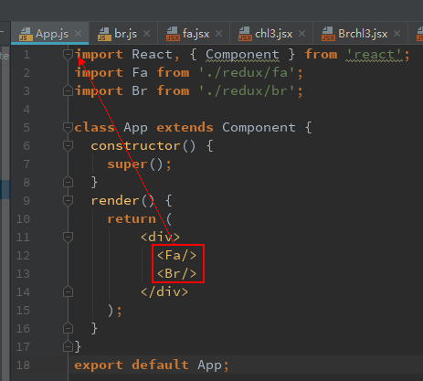
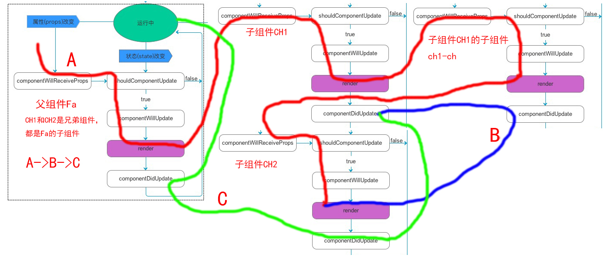

`在阅读时，connect组件 包含dispatch 或 state
这里的包含dispatch(d)是指connenct mapDispatchToProps export的组件
这里的state(s)是指connenct mapStateToProps export的组件`

1、说明componentWillReceiveProps相当于setState，
无论是单独componentWillReceiveProps或setState,
会让组件链都触发componentWillReceiveProps，但其中的含connect不受影响，
但如果给此connect组件设置 函数props属性，那么此connect组件也将会触发componentWillReceiveProps；
但如果给此connect组件设置 非函数props属性，那么此connect组件也将不会被触发componentWillReceiveProps；
	{
		说明：
		a、connect组件 包含dispatch 或 state 或同时包含dispatch、state
		b、会让组件链都触发componentWillReceiveProps，但其中的含connect不受影响，
			且是否影响，这个与此connect组件 是否为dispatch或state 无关，而与设置此connect组件props属性是否为函数props有关
		c、以下情况不触发：
		this.cssd={a:66}
		<Chl dad={this.cssd} />

		doalert(){alert(e)}
		<Chl ccd={this.doalert} />

		以下情况触发
		<Chl ccd={(e)=>alert(e)} />
		<Chl ccd={{a:66} />
		<Chl dddv={this.state.inputV} />（当setState(inputV),如果没有也不会触发）
		【直接定义到组件上，每次render相当于从新创建一个对象或函数，
		因为对象或函数都是引用类型，会被react认为是不同的对象，就认为发生变化，从而触发render】

	}
2、单纯的dispatch不会触发任何组件的生命周期，包含dispatch组件本身的render也不会触发，
只触发组件链子孙组件中带connenct mapStateToProps export的，会令此组件触发componnetwillReceviedProps，
注意也不能触发connenct mapDispatchToProps export的

3、Fa中设置了s,当组件链中，无论是什么组件进行了 dispatch ,都会从组件链的最父级开始触发componentWillReceiveProps

4、当组件链中，父层、子层、孙层都有 state 的connect时，当有组件dispatch时，组件链中的任何组件都只触发一次render,
比如孙层有 state 的connect，孙层会render下，然后接受从祖、父层的render，又进行render两次，这是不会的。

5、在componentWillReceiveProps中setState，只触发一次render

6、先来看如下：
示例一：
如
App
-Fa(d)
   --chl
      --chlchl(s)
   --ch2
      --ch2chl(s)
-Br
  --Brchl3

Fa dispatch 、但未setState, chlchl和ch2chl 接受props 但未setState时，，此时有两个相对独立的组件链chlchl、ch2chl生命周期变动：

示例二：
如 （改示例参照’结果2-父-孙‘中最后一个示例）
App
-Fa(d)
   --chl(s)
      --chlchl(s)
   --ch2
      --ch2chl
-Br
  --Brchl3
Fa dispatch 、但未setState, chlchl 接受props 但未setState时，，此时只有一个组件链chlchl生命周期变动：

react 组件渲染规则：

react 会统筹同一时间内，有哪些组件会render,
然后 将所有要render 的组件 按照'从上到下，从外到内的'原则进行渲染。

某一段时间内可能有一个组件链或多个组件链进行render，此时他们都遵循'从上到下，从外到内的'原则进行渲染

7、react渲染的黄金准则：
#### 执行顺序是，从上到下，从外到内的顺序

图片中从上到下的优先级比从外到内高；
本例中
从上到下为上为Fa组件，下为Br组件，
从外到内：App为外，fa,chl。。。依次到内：

8、经典图示：

